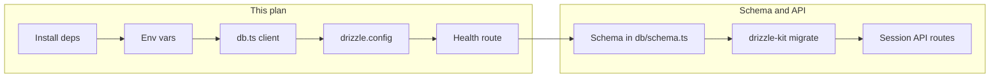

# Neon Database Basic Setup

Based on the [Neon Next.js guide](https://neon.com/docs/guides/nextjs), this prepares a minimal working database layer ready for sessions and API routes.

## Prerequisites (manual)

1. **Create a Neon project** at [console.neon.tech](https://console.neon.tech/app/projects)
2. Copy the **pooled** connection string (Connection pooling toggle ON) — hostname will include `-pooler`, e.g. `ep-xxx-pooler.us-east-2.aws.neon.tech`
   - Use pooled for Next.js serverless (avoids hitting `max_connections` under load)

## 1. Install dependencies

```bash
npm install @neondatabase/serverless drizzle-orm
npm install -D drizzle-kit
```

- `@neondatabase/serverless`: HTTP-based driver, ideal for serverless/Next.js
- `drizzle-orm`: ORM for schema and queries
- `drizzle-kit`: Migrations (generate + migrate)

## 2. Environment variables

Update `.env.example`:

```env
DATABASE_URL="postgresql://<user>:<password>@<endpoint>-pooler.<region>.aws.neon.tech/<dbname>?sslmode=require"
```

Add `DATABASE_URL` to your local `.env` (not committed) with the real Neon pooled connection string.

## 3. Database client module

Create `src/lib/db.ts`:

```typescript
import { neon } from "@neondatabase/serverless";
import { drizzle } from "drizzle-orm/neon-http";

const sql = neon(process.env.DATABASE_URL!);
export const db = drizzle(sql);
```

- Single shared client for all server-side usage (Server Components, Route Handlers, Server Actions)
- Drizzle's `neon-http` uses the Neon serverless driver under the hood

## 4. Drizzle configuration (for migrations)

Create `drizzle.config.ts` at project root:

```typescript
import { defineConfig } from "drizzle-kit";

export default defineConfig({
  schema: "./src/db/schema.ts",
  out: "./drizzle",
  dialect: "postgresql",
  dbCredentials: {
    url: process.env.DATABASE_URL!,
  },
});
```

- `schema` and `out` can be adjusted once you add the schema
- Run migrations with `drizzle-kit migrate` (or via npm scripts)

## 5. Smoke test (optional but recommended)

Add `src/app/api/health/db/route.ts`:

```typescript
import { db } from "@/lib/db";
import { sql } from "drizzle-orm";

export const dynamic = "force-dynamic";

export async function GET() {
  const [{ version }] = await db.execute(sql`SELECT version()`);
  return Response.json({ ok: true, version });
}
```

- Hit `GET /api/health/db` to confirm connectivity
- `force-dynamic` prevents Next.js from caching the response

## File structure after setup

```
src/
  lib/
    db.ts          # Shared Drizzle client
  db/
    schema.ts      # (add later)
drizzle.config.ts
.env.example
```

## Flow for next steps



After this setup you can:

- Import `db` in any server component or route
- Add schema and run migrations
- Implement session CRUD using `db.select()`, `db.insert()`, `db.update()`

## Notes

- **Connection string**: Use pooled (`-pooler` in hostname) for serverless; direct for migrations if needed
- **Edge**: Neon serverless driver supports edge runtime; add `export const runtime = 'edge'` if required
- **Local dev**: Optional `npx neonctl@latest init` for branch management and local workflows
